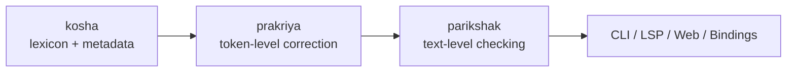

# Varnavinyas (वर्णविन्यास)

Open-source Nepali orthography tooling based on Nepal Academy standards.

*शुद्ध नेपाली, सबैका लागि।*  
*(Correct Nepali, for everyone.)*

## What This Project Is

Varnavinyas is a Rust workspace for checking and normalizing Nepali text.

It is built for three kinds of users:
- writers, editors, teachers, students, and institutions that need standard Nepali spelling and punctuation
- developers who want a reusable Nepali orthography engine
- contributors who want Academy-aligned rules implemented transparently and auditable in code

The project focuses on:
- word-level orthography correction
- punctuation diagnostics
- rule tracing with Academy citations
- web, CLI, editor, and binding surfaces on top of the same core engine

Diagnostics use stable `category_code` values across the web app, CLI, LSP, and bindings so filtering and highlighting stay consistent.

## Use Varnavinyas

### Browser

Use the hosted web app linked from the repository homepage.

The web app includes:
- text checker
- word inspector
- rules reference

### CLI

Build the workspace:

```bash
cargo build --workspace
```

Run the checker:

```bash
cargo run -p varnavinyas -- check
```

Run with JSON output:

```bash
cargo run -p varnavinyas -- check --format json
```

### Editor / LSP

The workspace includes an LSP server in `crates/lsp` for editor integrations and diagnostic surfacing.

### Bindings

Public bindings exist for:
- WebAssembly: `crates/bindings-wasm`
- Python: `crates/bindings-python`
- C: `crates/bindings-c`
- UniFFI: `crates/bindings-uniffi`

## Architecture At A Glance



The core flow is:

1. `kosha` provides lexicon lookup and metadata
2. `prakriya` decides token-level standard form and rule trace
3. `parikshak` runs text-level checking, span handling, padayog/padabiyog passes, punctuation, and heuristics
4. CLI, web, LSP, and bindings present those diagnostics to users

The main crates are:
- `crates/prakriya`: token-level orthography engine
- `crates/parikshak`: end-to-end text checker
- `crates/kosha`: lexicon and headword metadata
- `crates/lekhya`: punctuation diagnostics
- `web/`: browser UI backed by WASM

Inside `crates/prakriya`:
- `src/varna_vinyasa/` owns Academy orthography families
- `src/usage_fixes/` owns later cleanup-style rules
- `src/runtime.rs` assembles and caches runtime rule dispatch
- `src/model/` owns core derivation types

Inside `crates/parikshak`:
- `src/checker/word_level.rs` owns token-level integration
- `src/checker/padayog.rs` owns join/split text passes
- `src/checker/punctuation.rs` owns punctuation diagnostics
- `src/checker/style_variants.rs` and `src/checker/grammar.rs` own higher-level heuristics

## Workspace Layout

```text
crates/
  core:       akshar lipi shabda sandhi types
  checking:   kosha prakriya lekhya parikshak
  analysis:   vyakaran samasa eval
  surfaces:   cli lsp bindings-*
web/
docs/
```

For new contributors, the crate split is easiest to read as four groups:

- Foundation crates
  - `crates/akshar`: Devanagari normalization, classification, and akshara utilities
  - `crates/lipi`: transliteration and legacy-font conversion helpers
  - `crates/types`: shared domain enums and data types

- Language knowledge crates
  - `crates/kosha`: lexicon lookup and headword metadata
  - `crates/shabda`: origin classification and lightweight decomposition
  - `crates/sandhi`: sandhi rules and helpers

- Checking engine crates
  - `crates/prakriya`: token-level orthography derivation and rule tracing
  - `crates/lekhya`: punctuation diagnostics
  - `crates/parikshak`: full-text checker pipeline that composes the lower layers

- Analysis and surface crates
  - `crates/vyakaran`, `crates/samasa`: grammar and compound-analysis support
  - `crates/eval`: evaluation harnesses over curated fixtures
  - `crates/cli`, `crates/lsp`, `crates/bindings-*`: user-facing delivery surfaces
  - `web/`: browser UI backed by the WASM bindings

## Build And Test

### Prerequisites

- Rust 1.85.0+
- Cargo
- optional for web builds: `wasm-pack` and `wasm-bindgen-cli`

### Main Commands

```bash
cargo build --workspace
cargo fmt --all --check
cargo clippy --workspace --all-targets -- -D warnings
cargo test --workspace -q
```

Build the web app:

```bash
bash web/build.sh
```

Smoke-test the web app:

```bash
bash web/smoke-test.sh
```

Serve the built web app locally:

```bash
python3 -m http.server 8080 --directory web/
```

## Documentation

Start here:
- [docs/README.md](docs/README.md)

Key docs:
- [docs/VISION.md](docs/VISION.md) — why the project exists
- [docs/ARCHITECTURE.md](docs/ARCHITECTURE.md) — system design and crate boundaries
- [docs/DEVELOPMENT.md](docs/DEVELOPMENT.md) — build and test workflow
- [docs/DATASETS.md](docs/DATASETS.md) — datasets and provenance
- [docs/RULES.md](docs/RULES.md) — rule implementation notes
- [docs/STATUS.md](docs/STATUS.md) — current feature matrix
- [docs/EXTENSION_WASM_CONTRACT.md](docs/EXTENSION_WASM_CONTRACT.md) — downstream browser artifact and WASM contract
- [docs/Notices-pages-77-99.md](docs/Notices-pages-77-99.md) — Academy reference used for rule alignment

Crate-specific architecture docs:
- [crates/prakriya/ARCHITECTURE.md](crates/prakriya/ARCHITECTURE.md)
- [crates/parikshak/ARCHITECTURE.md](crates/parikshak/ARCHITECTURE.md)

## Contributing

Technical and non-technical contributions are welcome.

Start with:
- [.github/CONTRIBUTING.md](.github/CONTRIBUTING.md)
- [docs/RUST_GUIDE.md](docs/RUST_GUIDE.md)
- [docs/BACKLOG.md](docs/BACKLOG.md)

Community and process files:
- [.github/CODE_OF_CONDUCT.md](.github/CODE_OF_CONDUCT.md)
- [.github/SECURITY.md](.github/SECURITY.md)
- [.github/SUPPORT.md](.github/SUPPORT.md)

## License

Dual-licensed under MIT or Apache-2.0.

- [LICENSE-MIT](LICENSE-MIT)
- [LICENSE-APACHE](LICENSE-APACHE)
