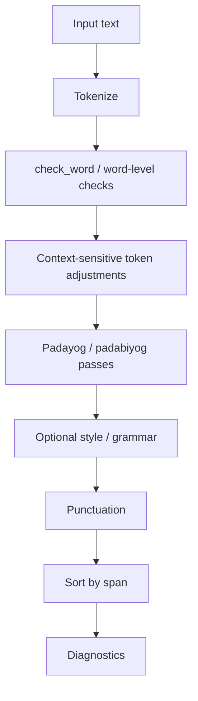

# varnavinyas-parikshak Architecture

This document describes the high-level architecture of `varnavinyas-parikshak`.

The goal of this crate is explicit: take text input, run the relevant
token-level and text-level checks, and return unified diagnostics with spans and
categories.

## Goals

- Keep `prakriya` as the source of token-level orthographic truth.
- Keep text-level context decisions in `parikshak`, not in token derivation.
- Combine hard errors, variants, and heuristic suggestions in one pipeline.
- Preserve stable category and rule metadata for UI, CLI, and bindings.

## Core Types

The main public types are:

- `Diagnostic`: one flagged span in text
- `DiagnosticCategory`: stable outward-facing category code set
- `CheckOptions`: runtime knobs for grammar and punctuation behavior
- `Token` / `AnalyzedToken`: tokenization outputs for text passes

`DiagnosticReason` is a type alias to `varnavinyas_prakriya::Explanation`, so
alternate applicable reasons share the same outward-facing explanation model as
`WordAnalysis`.

## Pipeline

`check_text_with_options(text, options)` follows this order:



1. tokenize text into `AnalyzedToken`s
2. run token-level orthography checks through `check_word`
3. adjust context-sensitive token cases that need neighboring token context
4. run text-level padayog/padabiyog passes
5. optionally run style/grammar heuristic passes
6. run punctuation diagnostics
7. filter noop heuristics if disabled
8. sort diagnostics by span

This keeps the highest-confidence token corrections early and lets later passes
respect already-blocked spans.

## Token Contract

`check_text_with_options` tokenizes once into `AnalyzedToken`s. New text-level
passes should consume that shared token slice instead of re-splitting the source
string. Existing `whitespace_segments` users are migration targets for the
tokenize-once refactor.

The token contract is:

- `start`/`end` are byte offsets into the original input and cover the token
  surface, excluding boundary punctuation.
- `source_text(text)` returns the exact original substring for the token span.
- `stem` and `suffix` expose conservative suffix/particle detachment; if a
  suffix is detached, `surface()` reconstructs the full token form.
- `span()` is the stable unit for blocking and conflict checks.
- `is_devanagari_word()` and `is_numeric()` centralize the filters that
  padayog, particle, and style passes previously computed locally.
- Neighbor-sensitive passes should use `tokens.windows(2)` or
  `tokens.windows(3)` so phrase spans are formed from the first and last token
  offsets.
- Attached punctuation remains outside token spans. Exact literal phrase
  rewrites may still use source-string matching and boundary checks when they
  intentionally need punctuation-sensitive behavior.

### Example

```text
input text:  यो बाक्यमा गल्ति छ.

possible passes:
- word-level:  बाक्यमा -> वाक्यमा
- punctuation: final '.' under Nepali punctuation policy
```

One input string can therefore produce multiple diagnostics owned by different
passes in the same pipeline.

## Module Ownership

- `checker.rs`
  Owns pipeline orchestration and runtime options.

- `checker/word_level.rs`
  Owns token-level integration with `prakriya` and `kosha`.

- `checker/padayog.rs`
  Owns text-level padayog/padabiyog passes.

- `checker/padayog_rules.rs`
  Owns explicit `(घ)` rewrite tables backing the padayog pass.

- `checker/punctuation.rs`
  Owns punctuation diagnostics.

- `checker/style_variants.rs`
  Owns style-only phrase suggestions.

- `checker/grammar.rs`
  Owns optional grammar-aware heuristics behind the feature gate.

- `tokenizer.rs`
  Owns practical tokenization and suffix-aware token analysis.

- `diagnostic.rs`
  Owns the outward-facing diagnostic model and stable category codes.

- `presentation.rs`
  Owns serializable DTOs for bindings and CLI/JSON output.

## Boundary With `prakriya`

`prakriya` is token-centric and deterministic.

`parikshak` adds:

```text
prakriya   -> "this token should become that token"
parikshak  -> "this span in this text should be flagged"
```

- tokenization
- lexicon-aware ambiguity handling
- phrase-level join/split passes
- punctuation
- optional grammar/style heuristics
- span management

Practical rule:

- if a rule transforms one token into another token, prefer `prakriya`
- if a rule needs neighboring tokens, spacing, or sentence context, prefer `parikshak`

Section `3(घ)` is the clearest example of this boundary.

### Example

```text
prakriya:   राजनैतिक -> राजनीतिक
parikshak:  तलमाथि -> तल माथि
```

The first is a one-token normalization problem. The second is a text-level
join/split problem.

## Category Contract

`DiagnosticCategory` is a stable outward-facing contract.

UI code, CLI JSON, bindings, and the LSP all rely on its `category_code`
values. Category evolution therefore requires synchronized updates across:

- Rust category mapping
- web category metadata
- CSS category selectors
- smoke tests and any UI assumptions

This is why category additions are small but cross-cutting changes.

### Example

If a new category code is introduced in Rust, the same change usually has to be
reflected in:

- `web/js/rules-data.js`
- `web/js/utils.js`
- `web/css/style.css`
- any smoke tests that assume the category set

## Design Principles

- Prefer explicit passes over generic rule frameworks.
- Keep pass ownership local to the module doing the work.
- Keep heuristic suggestions conservative and easy to disable.
- Treat token-level and text-level correctness as separate concerns.
- Preserve stable outward-facing diagnostic codes.
