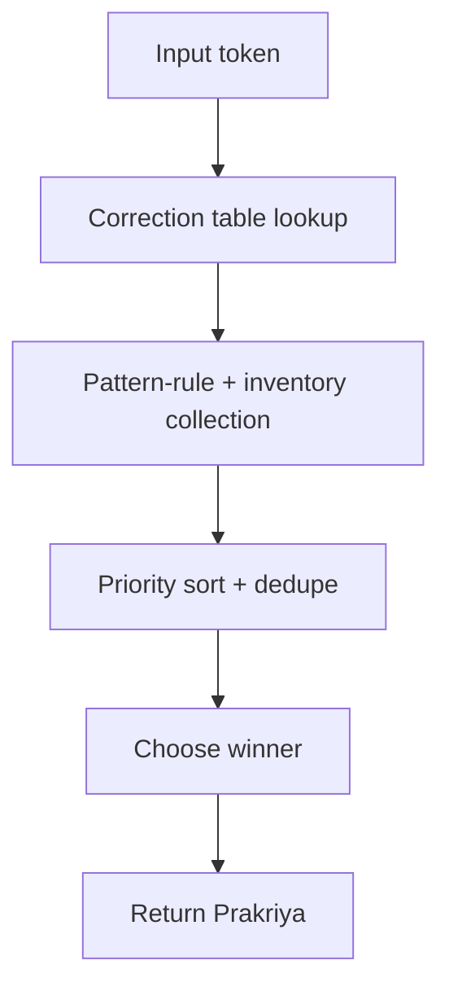
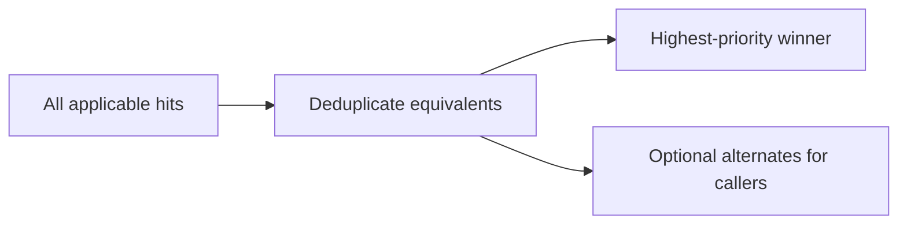

# varnavinyas-prakriya Architecture

This document describes the high-level architecture of `varnavinyas-prakriya`.

The goal of this crate is narrow and explicit: given one token, determine the
standard orthographic form and explain why that form is preferred.

## Goals

- Keep rule application order obvious from the source.
- Keep Academy traceability visible in code and diagnostics.
- Prefer deterministic token-level transforms over speculative context-aware logic.
- Support one production winner while still allowing tools to inspect alternate hits.

## Core Types

The main types are:

- `Prakriya`: the chosen token-level correction path
- `Step`: one applied rule step in that path
- `RuleHit`: one independently applicable rule result before winner selection
- `RuleSpec` / `PatternRule`: stable rule metadata plus apply function
- `Explanation`: shared outward-facing explanation used by analysis and diagnostics

These types are implemented under `src/model/`. The crate root re-exports the
main public types directly. `Explanation` lives separately because it is a
presentation-facing shared model, not part of the core derivation state.

## Rule Pipeline

`derive(input)` follows a simple procedural pipeline:



1. authoritative correction-table lookup
2. pattern-rule and compiled-inventory collection from the registry
3. priority sort and equivalent-hit deduplication
4. choose the top hit as the production correction
5. if nothing fires, return the input as already correct

`collect_rule_hits(input)` exposes step 2 through 4 without changing the
single-winner behavior of `derive()`.

This design keeps correction behavior deterministic while enabling callers to
show alternate applicable reasons.

Rule inventories under `data/rule_inventories/` are not a separate rule engine.
They are parsed and validated by the rule modules that own them, then exposed
through the same `RuleHit` path as normal pattern functions.

### Example

```text
input:  सूमार्ग
output: सुमार्ग
rule:   3(क)(अ)-1

input:  राजनैतिक
output: राजनीतिक
rule:   correction table
```

The first case goes through pattern-rule collection. The second resolves
immediately through the authoritative correction table.

## Runtime Dispatch

`runtime.rs` owns the assembled pattern-rule list used during correction.

```text
usage_fix_rules()      \
                        -> runtime::pattern_rules() -> cached sorted list
varna_vinyasa_rules() /
```

Its responsibilities are:

- merge `usage_fix_rules()` and `varna_vinyasa_rules()`
- sort the combined list by priority
- cache the result for repeated use

This keeps registry assembly separate from the correction algorithm in
`engine.rs`.

## Module Ownership

The code is organized by domain ownership, not by incidental file size.

```text
src/
  model/            derivation state and rule types
  varna_vinyasa/    Academy rule families
  usage_fixes/      cleanup-style rules
  runtime.rs        dispatch assembly
  engine.rs         hit collection + winner selection
  analysis.rs       word analysis
  explanation.rs    outward-facing reason model
  presentation.rs   serializable DTOs

data/rule_inventories/
  *.tsv             cited inventories compiled into specific rule modules
```

- `varna_vinyasa/`
  Owns Academy orthography rule families under `३. नेपाली वर्णविन्यास`.
  Each family is grouped in its own module tree:
  - `hrasva_dirgha`
  - `chandrabindu_shirbindu`
  - `panchham`
  - `ustai_ucharan_varnaharu`
  - `halanta_ra_ajanta`
  - `aadhi_vriddhi`

- `usage_fixes/`
  Owns later cleanup-style rules that are not part of the main varna-vinyasa
  family layout, such as shuddha/ashuddha structural fixes.

  `varna_vinyasa::varna_vinyasa_rules()` and `usage_fixes::usage_fix_rules()`
  also own family-local rule assembly so registry composition stays close to
  the modules that define those rules.

- `niyama_registry.rs`
  Owns top-level registry composition only. It delegates family assembly to
  `varna_vinyasa` and `usage_fixes`, then exposes the resulting lists to the
  engine.

- `engine.rs`
  Owns winner selection, hit collection, and correction-table integration.

- `runtime.rs`
  Owns runtime dispatch setup for pattern rules.

- `analysis.rs`
  Owns explanatory word analysis for callers that need origin-aware notes.

- `explanation.rs`
  Owns the shared outward-facing explanation model used by `WordAnalysis` and
  `parikshak` alternate reasons.

- `presentation.rs`
  Owns stable serializable analysis DTOs for adapters and bindings.

## Registry Policy

The registry is explicit by design.

We do not use dynamic rule discovery or macro-generated registration because
the cost of a little boilerplate is lower than the cost of hidden control flow.

Family-local assembly functions live with the modules they describe:

- `varna_vinyasa::varna_vinyasa_rules()`
- `usage_fixes::usage_fix_rules()`

Inside `varna_vinyasa`, family helpers remain local so module ownership and
execution ownership stay aligned.

## Multi-Hit Policy

Production correction remains single-winner.

If multiple rules match the same token:



- all hits can be collected through `collect_rule_hits()`
- semantically equivalent hits are deduplicated
- the best-priority hit remains the production result returned by `derive()`

This is deliberate. The engine should stay deterministic even if UI surfaces
choose to display alternate applicable reasons.

`Explanation` exists so those UI-facing surfaces can share one reason model
without forcing `Prakriya` itself to become presentation-shaped.

### Example

`भौतीक` can match more than one explanatory path:

- primary winner: `3(क)(आ)-2`
- alternate applicable reason: `3(क)(आ)-6`

`derive("भौतीक")` still returns one winner. `collect_rule_hits("भौतीक")`
exposes both hits.

## Boundary With `parikshak`

`prakriya` is token-centric.

Rules that need phrase or sentence context should generally live in
`varnavinyas-parikshak`, not here. The clearest current example is most of
Section `3(घ)` padayog/padabiyog behavior.

Practical rule:

- token-level normalization belongs in `prakriya`
- text-level spacing, punctuation, and context heuristics belong in `parikshak`

### Example

```text
prakriya:   सूमार्ग -> सुमार्ग
parikshak:  तलमाथि -> तल माथि   (spacing/join-split style of issue)
```

## Design Principles

- Prefer plain functions over framework-heavy abstractions.
- Prefer explicit ordering over dynamic dispatch.
- Prefer domain-first modules over generic “utils” buckets.
- Keep comments and rule labels auditable against the Academy notices.
- Use TODO markers when a rule family is known but not yet safely modelable.
