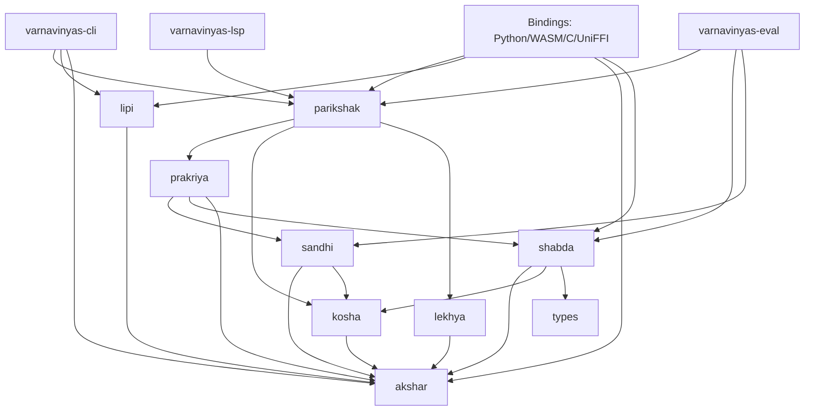

# Architecture

## Workspace Structure

Varnavinyas follows a flat crate workspace structure, ensuring modularity and clear separation of concerns.

```
varnavinyas/
├── Cargo.toml                    # Workspace root
├── crates/
│   ├── akshar/                   # Character & script utilities (Leaf crate)
│   ├── lipi/                     # Transliteration (Devanagari ↔ Roman)
│   ├── shabda/                   # Word analysis (Origin, Morphology)
│   ├── sandhi/                   # Sound change rules (Conjuncts, Vowel combinations)
│   ├── prakriya/                 # Derivation engine (Rule application, Tracing)
│   ├── kosha/                    # FST-based Lexicon (Storage)
│   ├── lekhya/                   # Punctuation & Writing conventions
│   ├── parikshak/                # Spell Checker (Integration crate)
│   ├── bindings-python/          # PyO3 bindings
│   └── bindings-wasm/            # WASM bindings
└── docs/                         # Documentation
```

## Crate Dependency Graph

The dependencies form a strict Directed Acyclic Graph (DAG), with `akshar` as the foundation and `parikshak` as the top-level integrator.



### Core Components

1.  **varnavinyas-akshar**: The foundational layer. Handles Unicode normalization, Devanagari character classification (Vowels, Consonants, Matras), and syllable segmentation.
2.  **varnavinyas-kosha**: A memory-efficient FST (Finite State Transducer) lexicon. It stores ~51k+ headwords and provides sub-microsecond lookups.
3.  **varnavinyas-prakriya**: The derivation engine. It applies orthography rules (hrasva/dirgha, etc.) to explain *why* a word is correct or incorrect, providing step-by-step traces.
4.  **varnavinyas-parikshak**: The user-facing spell checker. It orchestrates tokenization, lexicon lookup, and rule application to produce diagnostics.

## Data Flow: Spell-Check Pipeline

When a user submits text for checking:

1.  **Tokenization** (`akshar`): Text is harmonized (Unicode Normalization) and split into words.
2.  **Lexicon Lookup** (`kosha`):
    *   Words are checked against the FST.
    *   **known-correct**: Pass.
    *   **known-incorrect**: Flagged immediately with a correction (e.g., *अत्याधिक* → *अत्यधिक*).
    *   **unknown**: Passed to the rule engine.
3.  **Rule Analysis** (`prakriya`):
    *   The word is analyzed for structural violations (e.g., Hrasva/Dirgha rules based on patterns).
    *   `shabda` determines word origin (Tatsam/Tadbhav) to select appropriate rules.
4.  **Diagnostics** (`parikshak`): Errors are collected with rule citations and returned to the user.

## Design Decisions

### 1. FST for Lexicon
We use the `fst` crate to store the lexicon.
*   **Why**: Extremely compact (entire dictionary in < 50MB) and fast.
*   **Trade-off**: Immutable at runtime (requires rebuild to add words).

### 2. Code-Driven Rules
Orthography rules are encoded as Rust functions, not external configuration files.
*   **Why**: Compiler guarantees, ease of testing, and performance.
*   **Auditability**: Every rule function includes a docstring citing the specific Nepal Academy Orthography Standard section it implements.

### 3. Error Handling
We use `thiserror` for library errors. Each crate defines its own `Error` enum (e.g., `AksharError`, `KoshaError`), which are unified into `ParikshakError` at the top level. This ensures precise error handling across boundaries (FFI, WASM).
