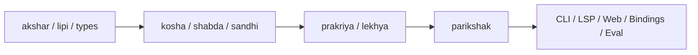
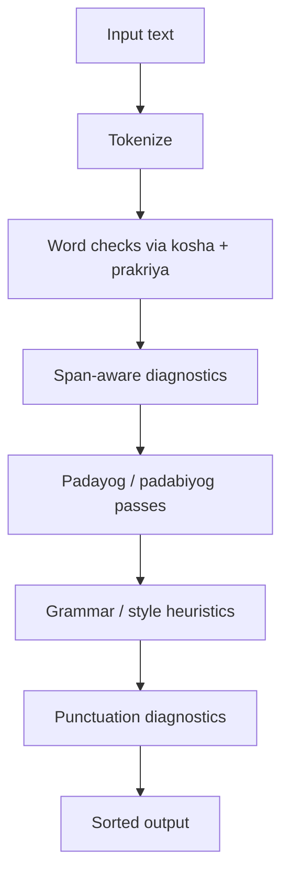

# Architecture

This document describes the workspace-level architecture of Varnavinyas.

The project is organized around one core idea:

- token-level orthography decisions should be deterministic and traceable
- text-level diagnostics should compose those token decisions with context, punctuation, and higher-level passes

## Workspace Shape

Varnavinyas is a Rust workspace with clear crate boundaries.

At a high level:

- `akshar`, `lipi` handle script and text utilities
- `kosha` and `shabda` provide lexical and morphological knowledge
- `prakriya` decides token-level standard form and rule trace
- `parikshak` runs full-text checking and span-based diagnostics
- `lekhya` handles punctuation diagnostics
- CLI, LSP, web, and language bindings present those diagnostics to users


```mermaid
flowchart LR
    A[akshar / lipi / types]
    B[kosha / shabda / sandhi]
    C[prakriya / lekhya]
    D[parikshak]
    E[CLI / LSP / Web / Bindings / Eval]

    A --> B --> C --> D --> E
```

## Crate Roles

### Core language/data crates

- `crates/akshar`
  - Unicode normalization helpers
  - Devanagari classification
  - akshara splitting and script utilities

- `crates/lipi`
  - transliteration
  - legacy font conversion

- `crates/types`
  - shared data/model types used across crates

- `crates/shabda`
  - origin classification
  - lightweight morphological decomposition

- `crates/sandhi`
  - sandhi analysis and helpers

### Normative checking stack

- `crates/kosha`
  - lexicon lookup
  - headword metadata
  - compile-time lexical assets

- `crates/prakriya`
  - token-level orthography engine
  - Academy-aligned rule families under `src/varna_vinyasa/`
  - later cleanup rules under `src/usage_fixes/`
  - runtime rule dispatch in `src/runtime.rs`
  - shared outward-facing explanation model in `src/explanation.rs`

- `crates/lekhya`
  - Section 5 punctuation diagnostics

- `crates/parikshak`
  - end-to-end checker pipeline
  - tokenization
  - token-level integration with `prakriya`
  - padayog/padabiyog passes
  - punctuation integration
  - optional grammar/style passes
  - stable outward-facing `category_code` contract

### Grammar/evaluation crates

- `crates/vyakaran`
  - grammar-oriented analysis used by optional higher-level passes

- `crates/samasa`
  - samasa analysis support

- `crates/eval`
  - evaluation harnesses over curated fixtures

### User-facing surfaces

- `crates/cli`
  - terminal interface

- `crates/lsp`
  - editor integration through LSP

- `crates/bindings-wasm`
  - Rust-to-browser bridge for the web app

- `crates/bindings-python`
  - Python extension module

- `crates/bindings-c`
  - C-facing surface

- `crates/bindings-uniffi`
  - UniFFI-oriented bindings

- `web/`
  - static browser UI
  - checker, inspector, and rules reference

## Dependency Flow

The practical flow is:

```text
akshar/lipi/types
        ↓
   kosha + shabda + sandhi
        ↓
     prakriya + lekhya
        ↓
       parikshak
        ↓
cli / lsp / web / bindings / eval
```

Important boundary:

- `prakriya` is token-centric
- `parikshak` is text-centric

If a rule transforms one token into another token, it generally belongs in `prakriya`.
If a rule needs neighboring tokens, spacing, punctuation context, or sentence-level heuristics, it generally belongs in `parikshak`.

## Main Correction Pipeline

For a typical text check:


```mermaid
flowchart TD
    A[Input text]
    B[Tokenize]
    C[Word checks via kosha + prakriya]
    D[Span-aware diagnostics]
    E[Padayog / padabiyog passes]
    F[Grammar / style heuristics]
    G[Punctuation diagnostics]
    H[Sorted output]

    A --> B --> C --> D --> E --> F --> G --> H
```

1. text is tokenized
2. each token is checked against `kosha` and `prakriya`
3. token-level diagnostics are turned into span-aware `Diagnostic`s
4. text-level passes add:
   - padayog/padabiyog diagnostics
   - punctuation diagnostics
   - optional grammar/style suggestions
5. diagnostics are sorted and exposed to the caller

## `prakriya` Internal Design

`prakriya` is internally organized by domain.

```text
prakriya/
  model/            core derivation types
  varna_vinyasa/    Academy rule families
  usage_fixes/      later cleanup-style rules
  runtime.rs        cached dispatch assembly
  engine.rs         hit collection + winner selection
  explanation.rs    shared outward-facing reason model
  presentation.rs   serializable DTOs
```

- `src/model/`
  - core derivation types such as `Prakriya`, `Rule`, `RuleSpec`, `Step`, `RuleHit`

- `src/varna_vinyasa/`
  - Academy orthography rule families such as:
    - `hrasva_dirgha`
    - `chandrabindu_shirbindu`
    - `panchham`
    - `ustai_ucharan_varnaharu`
    - `halanta_ra_ajanta`
    - `aadhi_vriddhi`

- `src/usage_fixes/`
  - later cleanup-style rules not modeled as the main Academy family layout

- `src/runtime.rs`
  - assembles and caches runtime rule dispatch

- `src/engine.rs`
  - collects rule hits
  - deduplicates equivalent hits
  - picks the production winner

- `src/explanation.rs`
  - shared outward-facing explanation model

## `parikshak` Internal Design

`parikshak` is split by pass ownership.

```text
parikshak/
  checker.rs                pipeline orchestrator
  checker/word_level.rs     token-level integration
  checker/padayog.rs        text join/split passes
  checker/padayog_rules.rs  backing rewrite tables
  checker/tiryak.rs         PS-Saisanik oblique-form diagnostics
  checker/particles.rs      nipat/particle spacing diagnostics
  checker/punctuation.rs    punctuation diagnostics
  checker/style_variants.rs style-only suggestions
  checker/grammar.rs        optional grammar heuristics
```

- `checker/word_level.rs`
  - token-level integration with `prakriya`

- `checker/padayog.rs`
  - join/split text passes

- `checker/padayog_rules.rs`
  - backing data for padayog/padabiyog rewrites

- `checker/tiryak.rs`
  - `PS-Saisanik` तिर्यक् diagnostics

- `checker/particles.rs`
  - nipat/particle spacing diagnostics

- `checker/punctuation.rs`
  - punctuation diagnostics

- `checker/style_variants.rs`
  - style-only phrase suggestions

- `checker/grammar.rs`
  - optional grammar-oriented heuristics

## Outward-Facing Contracts

Two contracts are intentionally stable across surfaces:

### 1. Rule explanations

`prakriya::Explanation` is the shared outward-facing reason model used by:

- `prakriya::WordAnalysis`
- `parikshak::DiagnosticReason`
- CLI JSON
- web/WASM
- bindings

### 2. Category codes

`parikshak::DiagnosticCategory` provides stable `category_code` values used by:

- web highlighting and filtering
- CLI JSON consumers
- LSP configuration
- bindings

Changing category codes is therefore a cross-cutting change, not a local UI tweak.

## Key Design Decisions

### Explicit rule registration

Rules are registered explicitly rather than discovered dynamically.

Why:
- easier to audit
- easier to keep aligned with Academy ordering
- less hidden control flow

### Plain functions over frameworks

Rule logic is mostly plain Rust functions.

Why:
- easier for contributors to read
- easier to test
- easier to map back to Academy notices

### Single production winner, optional alternate reasons

`derive()` remains single-winner for deterministic correction.

`collect_rule_hits()` exists so callers can inspect alternate applicable rules without changing the production result.

## Related Docs

- [README.md](../README.md)
- [DEVELOPMENT.md](DEVELOPMENT.md)
- [RULES.md](RULES.md)
- [crates/prakriya/ARCHITECTURE.md](../crates/prakriya/ARCHITECTURE.md)
- [crates/parikshak/ARCHITECTURE.md](../crates/parikshak/ARCHITECTURE.md)
