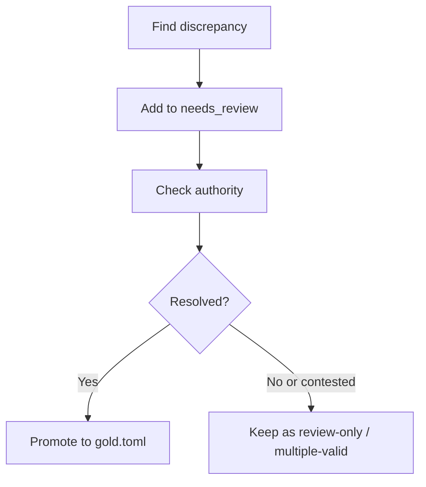

# Datasets & Test Fixtures

## Overview

Linguistic correctness is the primary goal of Varnavinyas. We manage our test data rigorously to separate "proven facts" from "debated interpretations."

## File Structure

Test data is located in `docs/tests/`:

```text
authoritative source
    ↓
candidate example
    ↓
docs/tests/*.toml
    ↓
crate tests / eval harnesses
    ↓
CI regression gate
```

*   **`gold.toml`** (The Ground Truth)
    *   Contains verified Correct/Incorrect pairs.
    *   **Source**: Directly cited from the authoritative Academy references used by this repo.
    *   **Usage**: CI tests fail if any entry here is not handled correctly.

*   **`needs_review.toml`** (The Holding Area)
    *   Contains ambiguous, disputed, or context-dependent pairs requiring expert linguistic review.

### Current Fixture Counts

As of 2026-07-03:

| File | Records |
|---|---:|
| `docs/tests/gold.toml` | 110 total records, including 47 `[[shuddha_table]]` records and 8 `[[halanta]]` records |
| `docs/tests/needs_review.toml` | 21 records |
| `docs/tests/grammar_sentences.toml` | 7 records |
| `docs/tests/morph_gold.toml` | 22 records |
| `docs/tests/samasa_gold.toml` | 3 records |

## Evaluation & Corpus Datasets

*   **`samasa_gold.toml` & `morph_gold.toml`**
    *   Gold standards for compound word (Samasa) classification and morphological decomposition.
    *   **Usage**: Used by `varnavinyas-eval` to track heuristic precision and recall regressions.

*   **`grammar_sentences.toml`**
    *   Sentence-level pairs testing contextual grammar diagnostic bounds.

*   **`data/headwords.tsv`**
    *   Canonical headword list with POS metadata (`word<TAB>pos`) used by `varnavinyas-kosha`.
    *   Current scale: ~132k headwords.

*   **`data/words.txt`**
    *   Surface-form lexicon used to build the fast containment index for spell-checking.
    *   Current scale: ~207k entries.

*   **`data/lexicon_overrides.tsv`**
    *   Reviewed quality-tier overrides for forms whose raw lexical attestation is not enough to make them safe correction targets.
    *   Used by `kosha::lexicon_tier()` and `kosha::is_correction_target()`.

*   **`data/rule_inventories/*.tsv`**
    *   Schema-checked rule inventories compiled into specific rule modules.
    *   Current pilots include `ajanta_halanta.tsv` and `ba_va_ps_sanskrit.tsv`.
    *   Rows must include source and review-status provenance and are validated by parser tests in the owning rule modules.

## Lexicon Provenance

`data/words.txt` and `data/headwords.tsv` are derived from the Sabdasakha dictionary database, whose Nepali lexicon is anchored in:

1.  **नेपाली बृहत् शब्दकोश** (Nepali Brihat Shabdakosh), Nepal Academy.
2.  **प्रज्ञा नेपाली बृहत् शब्दकोश** (Pragya Nepali Brihat Shabdakosh), Nepal Academy.

Usage in Varnavinyas:

1.  `words.txt` powers the compiled FST for fast existence checks.
2.  `headwords.tsv` provides headword-level metadata (POS/origin-tag parsing).
3.  `lexicon_overrides.tsv` marks reviewed forms that are attested but unsafe as generic correction outputs.

## Provenance Policy

Every entry in our datasets must have a traceback to an authoritative source.

1.  **Primary Sources**:
    *   *Nepal Academy Orthography Standard* — published by MoFAGA ([PDF](https://mofaga.gov.np/notice-file/Notices-20211029142422901.pdf)). Local excerpt/reference: `docs/Notices-pages-77-99.md`.
    *   *PS-Saisanik Vyakaran Varnavinyas* local reference: `docs/PS-Saisanik-Vyakaran-Varnavinyas-Page-327-349.md`.
2.  **Secondary Sources**: *LDTA Training Materials* (Government training docs).
3.  **Conflict policy**: when the Academy notice excerpt and `PS-Saisanik...` conflict, this repo currently prefers `PS-Saisanik...` and records the resolution in `docs/RULE_SOURCE_POLICY.md`.

### Promotion Flow

How a pair moves from `needs_review.toml` to `gold.toml`:



1.  **Identify**: A discrepancy or ambiguity is found (e.g., *फाउण्डेशन* vs *फाउन्डेसन* where the exam key conflicts with the standard).
2.  **Isolate**: Add it to `needs_review.toml` with a comment explaining the conflict.
3.  **Review**: Consult the *Linguistic Advisory Group* (or check updated prints of the standard).
4.  **Resolve**:
    *   If a specific rule clarifies it, move to `gold.toml`.
    *   If both are valid, mark as such (support multiple correct forms).
5.  **Test**: Ensure the code handles the new case, then commit.
