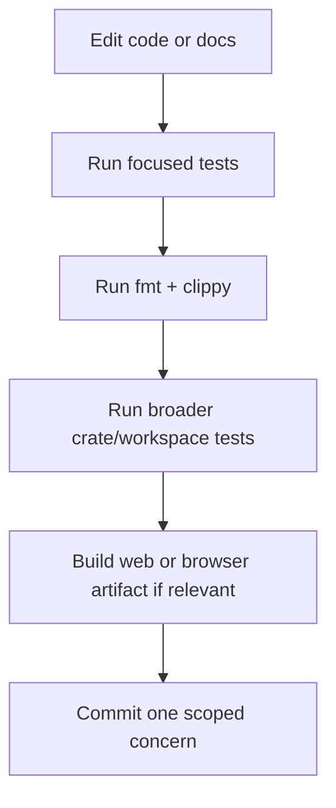

# Development Guide

## Prerequisites

- **Rust**: 1.85.0+ (Required for Edition 2024)
- **Cargo**: Standard installation
- **Optional**: `wasm-pack`, `wasm-bindgen-cli` (for web builds), `maturin` (for Python bindings)

## Main Commands

| Command | Description |
|---------|-------------|
| `cargo build --workspace` | Build all crates |
| `cargo test --workspace -q` | Run all unit and integration tests |
| `cargo fmt --all --check` | Formatting check |
| `cargo clippy --workspace --all-targets -- -D warnings` | Strict lint gate |
| `cargo deny check advisories bans licenses sources` | Dependency/license/advisory checks |
| `bash web/build.sh` | Build `web/pkg` from WASM bindings |
| `bash web/package-artifact.sh` | Build downstream browser artifact package |
| `bash web/smoke-test.sh` | Check web static/WASM asset consistency |

### Cargo Aliases
Check `.cargo/config.toml` for shortcuts:
- `cargo t` -> Run tests
- `cargo c` -> Run clippy
- `cargo f` -> Run format

## Focused Test Commands

Use these when working on a specific layer instead of the whole workspace:

- `cargo test -p varnavinyas-prakriya --tests -q`
- `cargo test -p varnavinyas-parikshak -q`
- `cargo test -p varnavinyas-parikshak --features grammar-pass -q`
- `cargo test -p varnavinyas-eval --tests -- --nocapture`
- `cargo test -p varnavinyas-eval --test grammar_eval -q`

## Typical Dev Loop



## Testing Strategy

We rely on a multi-layered testing approach to ensure linguistic correctness.

### 1. Unit Tests
Located in `src/` of each crate. Test individual functions and corner cases.

### 2. Integration Tests
Located in `tests/` of each crate. Verify cross-module interactions (e.g., `parikshak` using `kosha`).

### 3. Gold Dataset Tests
**Critical for Linguistic Integrity.**
We maintain a canonical "Gold" dataset in `docs/tests/gold.toml`.
*   **Rule**: ALL entries in `gold.toml` must pass.
*   **Run**: `cargo test -p varnavinyas-parikshak gold_incorrect_forms_detected -- --nocapture`.

### 4. Property-Based Tests
We use `proptest` to verify invariants, such as:
- `transliterate(transliterate(x)) == x` (Round-trip)
- `normalize(normalize(x)) == normalize(x)` (Idempotence)

## Web And Browser Artifact Workflow

```text
Rust/WASM code
    ↓
bash web/build.sh
    ↓
web/pkg
    ↓
web/smoke-test.sh
    ↓
bash web/package-artifact.sh
```

- `web/js/rules-data.js` is the source of truth for rule-to-category mapping in the browser UI.
- Keep diagnostics keyed by stable `category_code`, not display labels.
- `web/package-artifact.sh` is the supported handoff for downstream browser/extension clients.
- In sandbox-restricted environments, `web/smoke-test.sh` may skip HTTP-serving checks. Treat that as expected when the static asset checks still pass.

## CI

The GitHub Actions pipeline enforces:

1. build and test coverage on the Rust workspace
2. formatting and clippy
3. dependency/license/advisory checks
4. web and browser-artifact packaging checks where configured
