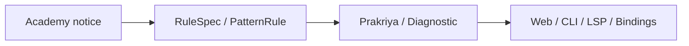

# Linguistic Rules

Varnavinyas encodes the rules of the **Nepali Orthography Standard (नेपाली वर्णविन्यास)** directly into Rust code. This document outlines the rule categories and how they map to the codebase.

## Sources

The rule layer currently uses two authoritative Academy references:

1. The Nepal Academy orthography standard published by the Ministry of Federal Affairs and General Administration (MoFAGA):

**[https://mofaga.gov.np/notice-file/Notices-20211029142422901.pdf](https://mofaga.gov.np/notice-file/Notices-20211029142422901.pdf)**

Local excerpt/reference: `docs/Notices-pages-77-99.md` (pages 77–99 of the notice).

2. The school-grammar reference used for additional and sometimes conflicting spacing/morphosyntactic guidance:

`docs/PS-Saisanik-Vyakaran-Varnavinyas-Page-327-349.md`

When these two sources conflict, the repo currently follows the source policy in `docs/RULE_SOURCE_POLICY.md`, which prefers `PS-Saisanik...` for the known conflict set.

## Rule Categories

The standard is divided into specific sections. We map these sections to our `Rule` enum in `crates/prakriya`.



| Standard Section | Description | Implementation Crate |
|------------------|-------------|----------------------|
| **Section 3(क)** | Hrasva/Dirgha (Vowel Length) | `prakriya` |
| **Section 3(ख)** | Chandrabindu / Shirbindu | `prakriya` |
| **Section 3(ग)** | Sibilants (श/ष/स) | `prakriya` |
| **Section 3(ङ)** | Halanta (Virama) usage | `prakriya` / `sandhi` |
| **Section 4** | Shuddha/Ashuddha Table | `kosha` (Lookup) |
| **Section 5** | Punctuation & Formatting | `lekhya` |

## High-Level Ownership

```text
Single-token normalization      -> prakriya
Multi-token spacing/context     -> parikshak
Punctuation                     -> lekhya
Lexical plausibility / metadata -> kosha + shabda
```

## Code-Driven Implementation

We do not use external JSON/YAML files for logic. Rules are functions.

### Example: Suffix '-nu'
*Rule: Verbs with the '-nu' suffix take Hrasva (short) vowels.*

```rust
// crates/prakriya/src/hrasva_dirgha.rs

/// Rule: Verbal suffixes like '-nu' trigger hrasva.
/// Ex: स्वीकार + नु = स्विकार्नु
pub fn rule_suffix_nu_hrasva(input: &str) -> Option<Prakriya> {
    // ... logic checking if word ends with nu and resolving root ...
}
```

## Diagnostics

When a rule is violated, the system produces a `Diagnostic` containing:
1.  **Incorrect Word**: The raw input.
2.  **Suggested Correction**: The structurally fixed form.
3.  **Rule Citation**: The specific section (e.g., "3(क)-12") so the user can look it up.
4.  **Explanation**: A human-readable string (localized in Nepali) explaining *why*.

### Alignment Strategy

To ensure our diagnostics match the standard:
*   We allow `kosha` (the lexicon) to override algorithmic rules for specific exceptions listed in Section 4.
*   Algorithmic rules in `prakriya` and phrase/context rules in `parikshak` are tested against the `gold.toml` dataset to ensure they produce the expected output for known cases from both authoritative sources.
