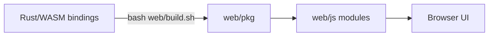

# Web App Guide

This directory contains the static web UI for Varnavinyas.

## What Is Here

```text
web/
  index.html          page shell
  css/style.css       styles
  js/*.js             app modules
  pkg/                generated WASM glue
  build.sh            WASM build helper
  package-artifact.sh downstream browser artifact packager
  smoke-test.sh       static consistency checks
```

- `index.html`: page shell
- `css/style.css`: styles
- `js/*.js`: app modules (checker, inspector, rules reference, wasm bridge)
- `pkg/`: generated WASM bindings consumed by the browser
- `build.sh`: builds `pkg/` from Rust WASM bindings
- `package-artifact.sh`: packages `pkg/` + metadata for downstream browser clients
- `smoke-test.sh`: quick end-to-end static checks

## Local Run

From repo root:

```bash
bash web/build.sh
bash web/package-artifact.sh
python3 -m http.server 8080 --directory web/
```

Open `http://localhost:8080`.



## Smoke Test

From repo root:

```bash
bash web/smoke-test.sh
```

The smoke test validates:

- WASM artifacts and exported functions
- category mapping consistency (Rust -> JS -> CSS)
- key static assets served by a local HTTP server

## Downstream Clients

This repo can also produce a browser-consumable artifact for downstream extension clients.

From repo root:

```bash
bash web/package-artifact.sh
```

This emits:

- `web/dist/varnavinyas-browser-artifact/`
- `web/dist/varnavinyas-browser-artifact.zip`

The artifact `manifest.json` is the downstream contract surface. It includes:

- `artifact_api_version`
- `capabilities`
- `required_exports`

`check_text_value(text, grammar)` is the backward-compatible default text API
and uses `academy-strict` orthography mode. Clients that need explicit policy
control should prefer `check_text_value_with_options(text, grammar,
orthography_mode)` when the manifest advertises that capability.

## Editing Notes

- Keep diagnostics keyed by `category_code` (machine-stable), not display labels.
- `checkText(..., { grammar: true })` enables heuristic/style variants in UI.
- `checkText(..., { orthographyMode: "common-editorial" })` downgrades only
  reviewed common-vs-strict orthographic forms to non-blocking variants. See
  `../docs/INTEGRATION_NOTES.md`.
- Rule citations are rendered through `wrapRuleTooltip(...)` in `js/rules-data.js`.

## Common Issues

- `wasm-bindgen-cli version mismatch`:
  run the version printed by `web/build.sh`.
- Browser still shows old behavior:
  hard refresh after rebuilding `web/pkg/`.
